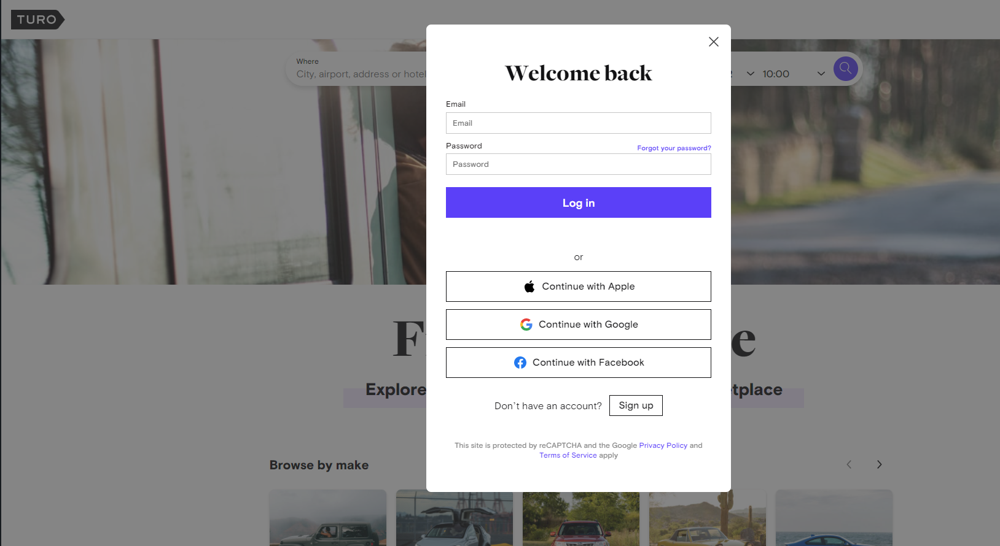

# Turo web crawler

Collects data for each trip on https://turo.com/.

## Prerequisite

- Must have Python3
- Must have google chrome and the revelent webdriver (https://chromedriver.chromium.org/downloads)

## Installation

- Clone the Repository into your enviroment (https://github.com/malikbensalem/Turo-web-crawler.git)

## How to use

For the first time it will ask the user to input there username and password then create a cookies.pkl file which saves the users information:

Do not minimise the window however users may move the window to the back.

Once the program completes it will make a csv file "turo[current time].csv"
